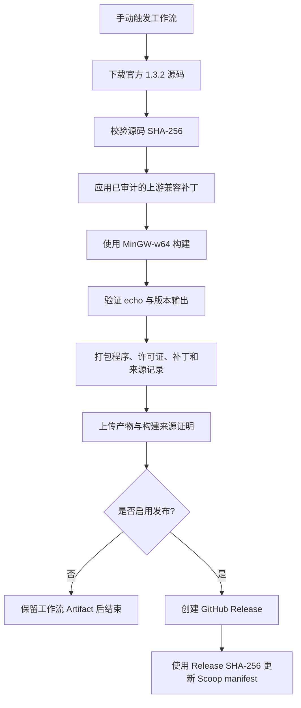

# Masscan Windows 构建

[English](README.md) | [简体中文](README.zh-cn.md)

[](https://github.com/VincentZyu233/masscan-windows-builds/actions/workflows/build.yml)

本仓库为 [Masscan](https://github.com/robertdavidgraham/masscan) 提供可复现的 Windows x64 构建和独立 Scoop bucket。

这是一个独立分发项目，与 Masscan 上游项目不存在隶属或官方背书关系。构建使用由 SHA-256 固定的官方上游源码归档，构建日志、产物、Release 校验和、兼容补丁及 GitHub 构建来源证明均公开可查。

## 使用 Scoop 安装

Masscan 在 Windows 上需要 [Npcap](https://npcap.com/)。请在扫描前安装并启用 Npcap；本软件包不会捆绑或重新分发 Npcap。

```powershell
scoop bucket add masscan-windows https://github.com/VincentZyu233/masscan-windows-builds
scoop install masscan-windows/masscan
```

使用以下不会发送扫描流量的命令验证安装：

```powershell
masscan --echo
masscan --version
masscan --iflist
```

部分 Masscan 版本会输出有效的 `--version` 信息，但仍以状态码 `1` 退出。这不代表可执行文件已经损坏；本仓库将 `--echo` 作为主要的无扫描健康检查。

## 构建流程



## 构建来源

- 上游源码：`robertdavidgraham/masscan`
- 上游版本：`1.3.2`
- 兼容补丁：从上游提交 `09ff4df9fdb13e435b89fdd2cdb678d182701362` 回移相关 MinGW 修复
- 构建目标：使用 MinGW-w64 构建 Windows x64 程序
- 许可证：AGPL-3.0-only

工作流首先支持不发布的 Artifact 试构建，仅在手动触发时启用 `publish` 才会创建 Release。

## 从上游源码构建

```powershell
scoop install git gcc make
git clone --branch 1.3.2 --depth 1 https://github.com/robertdavidgraham/masscan.git
cd masscan
make FLAGS2=
```

使用当前工具链构建上游 `1.3.2` 源码时还需应用仓库内的现代 MinGW 兼容补丁。生成的程序位于 `bin\masscan.exe`；运行时仍需安装 Npcap。

## 安全说明

Masscan 能以极高速度产生网络流量。请仅扫描已经获得明确授权的系统和网络，并根据目标环境设置保守的速率。
